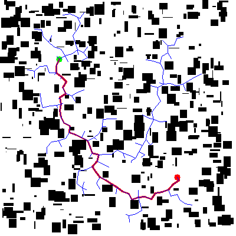
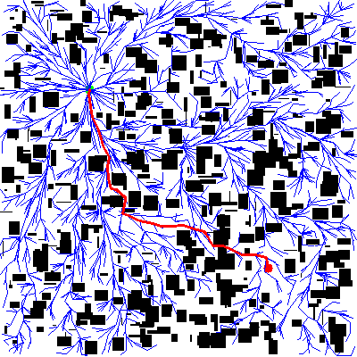
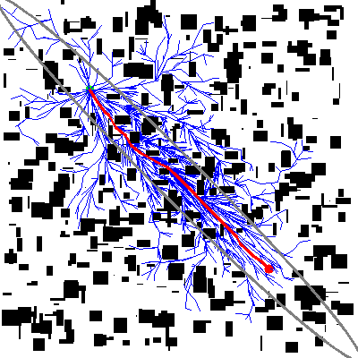
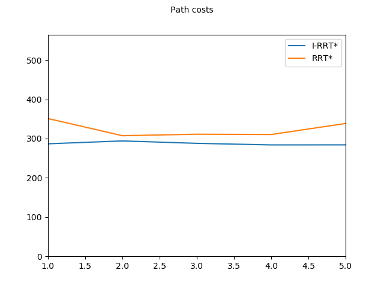
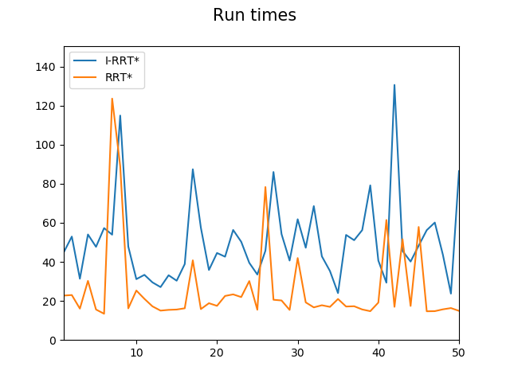

# A Comparative Study of Sampling-based Planners
## Introduction
This is a Python package which demonstrated the difference in performance between sampling-based planning algorithms such as RRT, RRT* and Informed RRT*.
## Setting up the package
```
git clone https://github.com/thisisjaskaran/informed-rrt-star.git
```
The config file can be used to switch and tune parameters such as step_size, search_radius, etc.
## Installing Dependencies
```
pip3 install -r requirements.txt
pip3 install opencv-python
```
## Running RRT
```
cd individual
python3 rrt.py
```
## Running RRT*
```
cd individual
python3 rrt_star.py
```

## Running I-RRT*
```
cd individual
python3 informed_rrt_star.py
```
## Sample Results
<p float="left">
    
    
    
</p>
(left to right) RRT, RRT*, Informed RRT*

## Running RRT* and I-RRT* on the same map
```
cd compare
python3 get_results.py
```
This will generate comparative plots of run times and best costs for both algorithms and save the plots and log the results in a csv file.
### Comparison Results
<p float="left">
    
    
</p>